# 開発ワークフロー

SSH/scp を用いたデプロイベースのワークフローです。

## システム全体図

```
Windows (Antigravity)
  │
  ├─ gh codespace ssh ──→ GitHub Codespaces (x86_64)
  │                         クロスコンパイル → aarch64バイナリ
  │                         scp → EC2 / RasPi5
  │
  ├─ Remote SSH ────────→ AWS EC2 arm64 (Graviton)  ← シミュレーション
  │                         bridge.py (port 8080/8765)
  │                         LD_PRELOAD=gpio_shim.so gpio_led_button
  │                           └─ ポートフォワード → Virtual Hardware Panel
  │
  └─ SSH ───────────────→ Raspberry Pi 5 (arm64)   ← 実機
                            gpio_led_button (LD_PRELOADなし)
                            → 実 LED / ボタン
```

---

## 開発シーケンス図

```mermaid
sequenceDiagram
    participant Dev as 開発者
    participant Win as Windows<br/>(Antigravity)
    participant GH as GitHub<br/>(Codespaces)
    participant EC2 as AWS EC2<br/>(シミュレータ)
    participant RPi as Raspberry Pi 5<br/>(実機)

    rect rgb(50, 30, 70)
        Note over Dev,GH: 【開発・編集・ビルド】
        Dev->>GH: C / Python / HTML ソース編集
        Dev->>GH: cd cuse-stubs && make cross
        GH-->>Dev: aarch64 バイナリ生成
    end

    rect rgb(70, 40, 20)
        Note over GH,EC2: 【EC2】デプロイ
        Dev->>GH: make deploy EC2=vibecode-graviton
        GH->>EC2: scp gpio_shim.so / gpio_led_button<br/>cuse_i2c / vl53l0x_read / web-bridge/
        EC2-->>GH: "Deploy complete"
    end

    rect rgb(40, 60, 30)
        Note over Dev,EC2: 【EC2】実行
        Dev->>EC2: ssh vibecode-graviton (ターミナル①)
        Dev->>EC2: ~/venv/bin/python3 ~/web-bridge/bridge.py
        EC2-->>Dev: [bridge] ws://0.0.0.0:8765 / :8080
        Dev->>EC2: ssh vibecode-graviton (ターミナル②)
        Dev->>EC2: LD_PRELOAD=~/gpio_shim.so ~/gpio_led_button
        loop LED 自動点滅 (100ms毎)
            EC2->>EC2: Unix socket 経由で bridge へ LED 状態送信
        end
    end

    rect rgb(60, 50, 20)
        Note over Dev,EC2: 【EC2】操作・観察
        Dev->>Win: Antigravity: Remote-SSH → vibecode-graviton
        Win->>EC2: SSH 接続 + ポート自動転送 (8080 / 8765)
        Dev->>Win: PORTS タブ → 8080 を Simple Browser で開く
        EC2-->>Win: LED 状態をリアルタイム送信
        Win-->>Dev: LED 点滅をパネルで可視化
        Dev->>Win: PUSH ボタンをクリック
        Win->>EC2: {"type":"button","line":17,"value":1}
        EC2-->>Win: LED トグル → パネル反映
    end

    rect rgb(20, 50, 60)
        Note over GH,RPi: 【RasPi5】デプロイ
        Dev->>GH: make deploy EC2=pi@raspberrypi KEY=~/.ssh/raspi.pem
        GH->>RPi: scp gpio_led_button / cuse_i2c / vl53l0x_read
        RPi-->>GH: "Deploy complete"
    end

    rect rgb(30, 60, 50)
        Note over Dev,RPi: 【RasPi5】実行
        Dev->>RPi: ssh pi@raspberrypi
        Dev->>RPi: ./gpio_led_button
        loop LED 自動点滅 (100ms毎)
            RPi->>RPi: 実 GPIO18 に出力 → LED 点滅
        end
    end

    rect rgb(50, 60, 30)
        Note over Dev,RPi: 【RasPi5】操作・観察
        Dev->>RPi: 物理ボタン (GPIO17) を押す
        RPi-->>Dev: 実 LED (GPIO18) がトグル点灯
    end
```



---

## コマンドリファレンス

| フェーズ | 場所 | コマンド |
|---|---|---|
| Codespaces SSH | Windows PS | `gh codespace ssh --codespace <name>` |
| クロスコンパイル | Codespaces | `cd cuse-stubs && make cross` |
| EC2 へデプロイ | Codespaces | `make deploy EC2=vibecode-graviton` |
| RasPi5 へデプロイ | Codespaces | `make deploy EC2=pi@raspberrypi KEY=~/.ssh/raspi.pem` |
| EC2 シェルアクセス | Windows PS | `ssh vibecode-graviton` |
| RasPi5 シェルアクセス | Windows PS | `ssh pi@raspberrypi` |
| ブリッジ起動 | EC2 | `~/venv/bin/python3 ~/web-bridge/bridge.py` |
| GPIO デモ (EC2) | EC2 | `LD_PRELOAD=~/gpio_shim.so ~/gpio_led_button` |
| GPIO デモ (RasPi5) | RasPi5 | `./gpio_led_button` |
